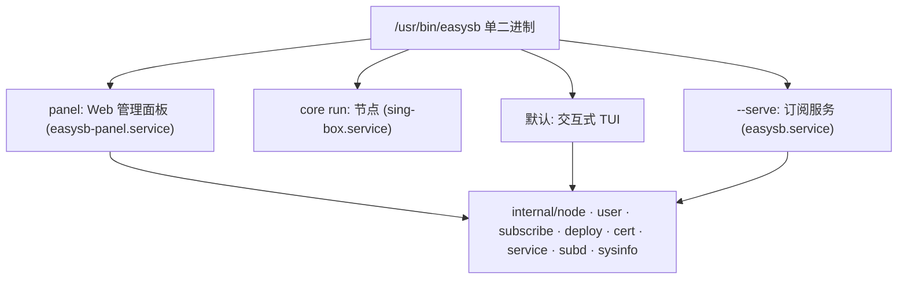
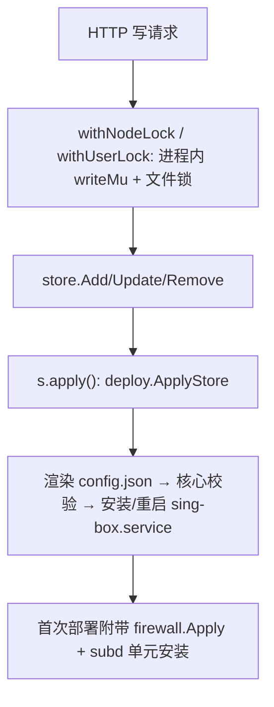

# Web 面板架构 / Panel Architecture

本文档描述 EasySB 原生 Web 管理面板（EasySB-Panel）的架构。面板不是业务逻辑的
第二份实现，而是 EasySB 二进制的一个新运行模式，调用与 TUI、订阅服务相同的 Go 包。

This document describes the architecture of EasySB's native Web management panel.
The panel is not a second implementation of the business logic: it is a new run mode
of the EasySB binary that calls the same Go packages the TUI and the subscription
service call.

## 1. 核心内嵌面板服务 / Core-embedded panel service

面板后端是 EasySB 二进制的子命令 `easysb panel`，拥有自己的 systemd 单元
`easysb-panel.service`。它与核心服务（`sing-box.service`）、订阅服务
（`easysb.service`）完全独立：面板崩溃或停止不会影响节点与订阅。

选择这一方案的原因：

- EasySB 已是单静态二进制，sing-box 编译在内；面板作为同一二进制的新模式可直接复用
  全部业务包，不存在“两份节点/账号数据 + 同步”问题。
- 三种服务是三个独立单元，面板故障不会停核心。

## 2. 数据所有权 / Data ownership

节点、账号、主机状态、证书仍归 EasySB 现有包所有，面板只读写这些文件，不引入第二份
业务存储。面板自身的运行配置单独存放。

| 数据 | 路径 | 所有者 | 面板角色 |
| :--- | :--- | :--- | :--- |
| 主机状态 | `/etc/sing-box/easysb.conf` | `internal/state` | 读写（域、证书、订阅端口、部署标记） |
| 节点 | `/etc/sing-box/easysb-nodes.json` | `internal/node` | 读写 |
| 账号 | `/etc/sing-box/easysb-users.json` | `internal/user` | 读写 |
| 渲染配置 | `/etc/sing-box/config.json` | `internal/deploy` | 只读/渲染 |
| 面板配置 | `/etc/sing-box/easysb-panel.conf` | `internal/panel` | 读写（0600） |
| 面板单元 | `/etc/systemd/system/easysb-panel.service` | `internal/panel` | 读写 |

面板配置刻意与 `easysb.conf` 分开：后者的 KV 布局要保持 legacy 兼容，不得承载面板
专属状态。面板配置字段见 `internal/panel/config.go`（`PANEL_LISTEN`、`PANEL_PORT`、
`PANEL_USER`、`PANEL_PASSWORD_HASH`、`PANEL_TLS`、`PANEL_CERT_FILE`、`PANEL_KEY_FILE`）。

## 3. 包结构 / Package layout

`internal/panel` 的组成：

| 文件 | 职责 |
| :--- | :--- |
| `config.go` | 面板配置的读写、默认值、地址/访问 URL、随机密码生成 |
| `auth.go` | bcrypt 口令、内存会话、登录限流、Cookie/令牌读取 |
| `server.go` | `Options`、`Service`、路由树、静态资源、JSON 辅助、写路径 `apply` |
| `run.go` | `Run`：监听、TLS 选择、优雅关闭 |
| `service.go` | 面板自身的 systemd 单元文本与生命周期 |
| `handlers_*.go` | 各资源的 HTTP 处理器 |
| `web/` | 内嵌的前端回退包（React 构建产物） |

`Options` 的每个路径都可注入，因此测试可对临时目录运行整个服务器；`Apply` 是一个
接缝，测试注入 no-op，避免触碰宿主机的 systemd 与线上 `config.json`。

## 4. 认证与会话 / Authentication and sessions

- 管理员口令以 bcrypt 存储（`PANEL_PASSWORD_HASH`），比较为常量时间。
- 会话保存在进程内存，默认 12 小时 TTL；面板重启即失效，管理员重新登录。
- 会话令牌可来自 `Authorization: Bearer <token>`（脚本客户端）或 HttpOnly、
  `SameSite=Strict` 的 Cookie `easysb_panel_session`（浏览器）。
- CSRF：通过 Cookie 认证的写请求（POST/PUT/PATCH/DELETE）必须带
  `X-EasySB-Panel: 1` 头，跨站表单无法设置该头；Bearer 客户端豁免。
- 登录限流：同一来源连续 5 次失败后锁定 15 分钟，返回 `429`。
- 用户名比较为常量时间；用户名错误时仍执行一次 bcrypt 比较，使错误用户名与错误口令
  耗时接近，无法按时间探测。

## 5. 写路径与并发 / Write path and concurrency

每一次节点或账号变更都以同一条路径生效（`deploy.ApplyStore`），与 TUI 完全一致：

- 进程内 `writeMu` 串行化面板自己的读-改-写，避免两个并发请求互相覆盖；`internal/node`
  与 `internal/user` 的文件锁防止与订阅服务/CLI 的其他进程冲突。
- 空节点集是合法状态：`deploy.ErrNoNodes` 被当作“未应用”而非错误。
- 核心拒绝配置时返回 `ErrRejected` → HTTP `422`，线上配置保持不变。

## 6. 前端 / Front end

- 技术栈：React + TypeScript + Arco Design React（Vite 构建），源码在独立仓库
  `EasySB-Panel`。前端由该仓库的 GitHub Actions 构建、作为 Release 资产发布，本仓库
  `make panel` 把它取到 `internal/panel/web` 后随二进制嵌入；编译产物不进版本库，Go 侧
  构建因此不需要 Node 工具链（详见 `scripts/fetch-panel.sh` 与 `internal/panel/web/README.md`）。
- 界面外观参照 1Panel：白底浅色卡片式布局、单一主色蓝、表格化信息密度；顶栏提供
  中英文切换与明暗主题切换，两者都持久化在 `localStorage`（`easysb_panel_lang`、
  `easysb_panel_theme`），暗色通过 `body[arco-theme='dark']` 交给 Arco 调色板。
  Arco 2.66 在 React 19 下需导入 `@arco-design/web-react/es/_util/react-19-adapter`
  （见 `src/main.tsx`），否则 Message/Notification 弹层拿不到 `createRoot`。
- 侧栏是"一块一块"的独立圆角菜单卡片（浅蓝灰底 + 选中态浅蓝填充与左侧蓝条），
  顶部为当前页胶囊标题；概览页按 1Panel 的"左主右辅"两栏排布：左列 **概览 / 状态 /
  监控**，右列 **系统信息 / 服务**。其中"服务"列展示域名、sing-box 版本、已启用协议
  （节点名与端口）与账号可用数，全部来自 `/api/v1/dashboard` 的真实 `host` 快照。
- "监控"是不造假的真实流量：后端 `sysinfo.NetworkTotals` 读 `/proc/net/dev`，经
  `GET /api/v1/system/network` 暴露累计收发字节；前端每 3s 轮询一次，用两次采样的差值
  算出上下行速率并绘制面积/折线图，计数器回绕或重启被夹到 0。明文 HTTP 访问时顶栏下方
  显示可关闭的安全提示条（建议启用 TLS）。
- 运行时优先服务磁盘上的 `/usr/share/easysb/panel`（发行版可放更新的前端），不存在时
  回退到内嵌包；未知 `/api/` 路径返回 JSON，其余路径回退到 SPA 的 `index.html`，
  客户端路由刷新不丢页。
- 前端在 `X-EasySB-Panel` 头与 Bearer 令牌上与后端保持同一约定（见 `src/api/client.ts`）。

## 7. 与 EasySB 其他入口的关系 / Relationship to the other entry points

- TUI 的“Web 面板”菜单与 Web API 的 `/panel/*` 调用同一组函数
  （`internal/panel.WriteUnit`、`Do`、`Installed` 等），安装/升级/启停/卸载行为一致。
- `easysb --print-unit panel` 打印与运行时写入完全相同的单元文本，`.deb` 打包使用同一
  文本，二者不会漂移。
- 未安装面板服务时 CLI/TUI 行为不变；面板是可选能力。

## 8. 安全边界 / Security boundary

- 面板默认监听 `0.0.0.0:2095`，默认明文 HTTP；生产环境应由 TLS 反向代理或防火墙
  保护。`PANEL_TLS` + 证书对可让面板直接以 HTTPS 提供服务。
- 列表接口不返回逐节点 uuid/password；订阅汇总接口不含 token；账号列表包含订阅 token
  （这是管理员展示订阅地址所必需），但不含节点凭据。日志不记录 query string，避免
  订阅 token 进入访问日志。
- 卸载面板只移除面板单元与进程，绝不删除节点、账号、证书或核心配置。
